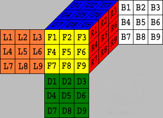

## 目的

为了更好的理解Kociemba二阶算法，遂翻译其主页。便于算法理解，后续4阶魔方还原算法参考。

## Facelet层面置换 

三阶魔方共有 6*9=54 个facelets

一次转动会使得facelets重新排列，我们把这个称之为置换。

U, R, F, D, B, L 代表着对应面顺时针旋转90°;
U2, R2, F2, D2, B2, L2 代表着对应面旋转180°;
U', R', F', D', B', L' 代表着对应面逆时针旋转90°.

F旋转会有如下结果

1. F1移动至F3 (F1-›F3), F2-›F6, F3-›F9, F4-›F2, F5-›F5, F6-›F8, F7-›F1, F8-›F4, F9-›F7.
F1 F2 F3 F4 F5 F6 F7 F8 F9
F3 F6 F9 F2 F5 F8 F1 F4 F7

2. F1被F7替换 (F1‹-F7), F2‹-F4, F3‹-F1, F4‹-F8, F5‹-F5, F6‹-F2, F7‹-F9, F8‹-F6, F9‹-F3. 
F1 F2 F3 F4 F5 F6 F7 F8 F9
F7 F4 F1 F8 F5 F2 F9 F6 F3

(F3,F6,F9,F2,F5,F8,F1,F4,F7)是“移动至”的表示方式
(F7,F4,F1,F8,F5,F2,F9,F6,F3)是“被替换”的表示方式

facelet阶段我们用“移动至”的表示方式，cobie阶段用“被替换”的表示方式。

在移动至的表示方式下，我们定义乘法如下：

F1 F2 F3 F4 F5 F6 F7 F8 F9
F2 F1 F6 F3 F5 F4 F8 F7 F9

\*

F1 F2 F3 F4 F5 F6 F7 F8 F9
F3 F6 F9 F2 F5 F8 F1 F4 F7

=

F1 F2 F3 F4 F5 F6 F7 F8 F9
F6 F3 F8 F9 F5 F2 F4 F1 F7

和普通乘法定义不同的是，置换的乘法不满足交换律。

当然从F和F'的操作结果，我们知道F\*F'=I.

F'就代表F的逆，这种情况下乘法是满足交换律的。

F'\*F=I

F转动的完整的表达

F:=(U1,U2,U3,U4,U5,U6,R1,R4,R7,D3,R2,R3,D2,R5,R6,D1,R8,R9,F3,F6,F9,F2,F5,F8,F1,F4,F7,L3,L6,L9,D4,D5,D6,D7,D8,D9,L1,L2,U9,L4,L5,U8,L7,L8,U7,B1,B2,B3,B4,B5,B6,B7,B8,B9)

因为有些facelet是有固定位置关系的，比如棱和角或者中心面。

所以facelet阶段的表达方式并不是很简洁，这也是为什么有cobie阶段存在。

## Cobie层面置换

这一层面我们置换的对象不再是facelets了，而是12条边和8个角。

12条边：UR, UF, UL, UB, DR ,DF, DL, DB, FR, FL, BL, BR

8个角：URF, UFL, ULB, UBR, DFR, DLF, DBL, DRB

cobie阶段不能仅靠边和角的排列组合表示魔方的状态，因为边和角是有方向的。

在初始位置上，角可以旋转，边也可以翻转。

在这一层面，我们用“被替换”的表达方式，表示一次旋转

同样还是F，URF被UFL替换(URF‹-UFL), UFL‹-DLF, ULB ‹-ULB, UBR‹-UBR,
DFR‹-URF, DLF‹-DFR, DBL ‹-DBL, DRB‹-DRB

可以表示如下：

|URF| UFL| ULB| UBR| DFR |DLF |DBL| DRB|
|--|--|--|--|--|--|--|--|--|
|UFL |DLF |ULB |UBR| URF| DFR| DBL| DRB|

因为角是有方向的

|URF | UFL | ULB| UBR| DFR| DLF| DBL| DRB|
|--|--|--|--|--|--|--|--|--|
|c:UFL;o:1 | c:DLF;o:2 | c:ULB;o:0 | c:UBR;o:0 | c:URF;o:2 | c:DFR;o:1 | c:DBL;o:0 | c:DRB,o:0 |

0:未旋转；1：顺时针旋转；2：逆时针旋转
如果有两个旋转是2+2=4，4对3取模得1，表示是一个顺时针旋转。

边也可以用类似的方式表示
0：未翻转；1：翻转

