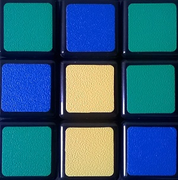
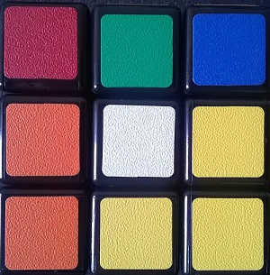
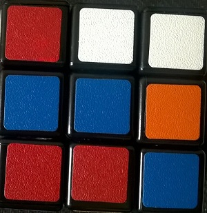
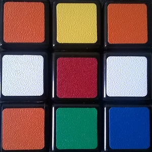
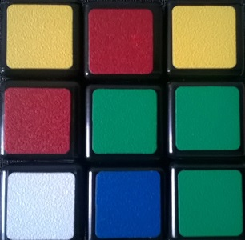
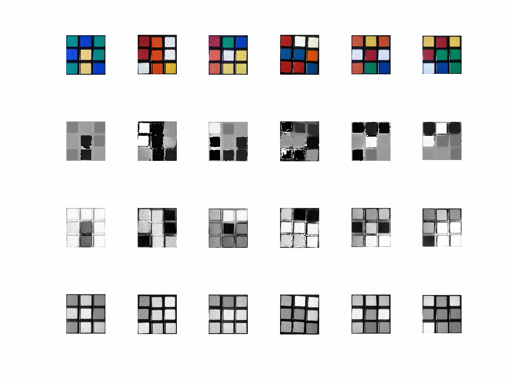
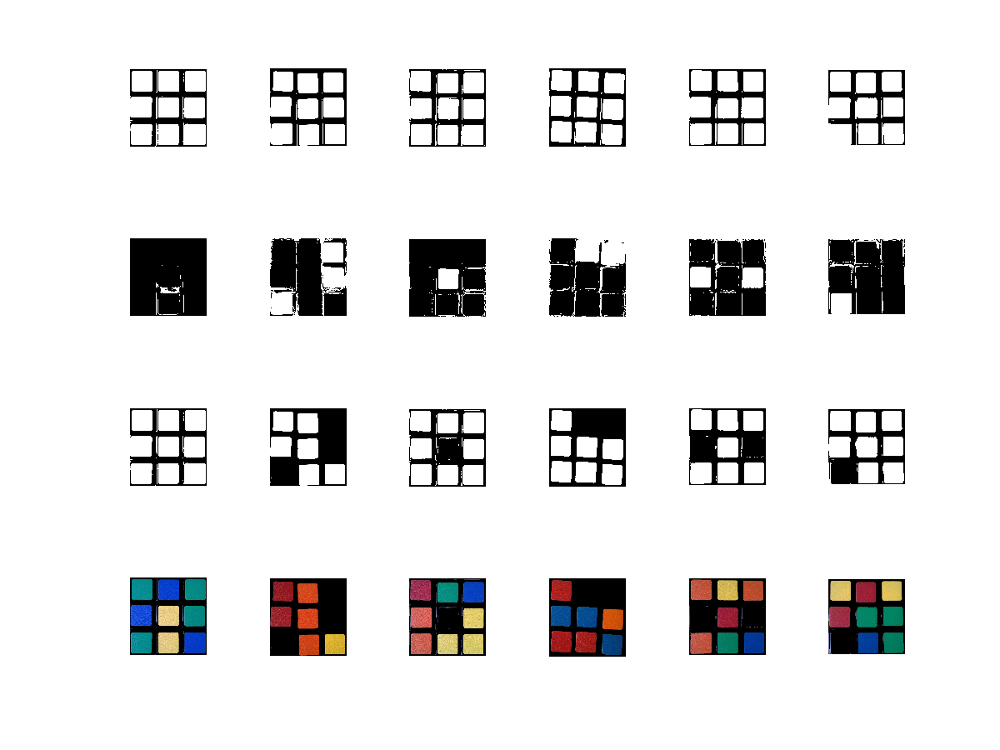
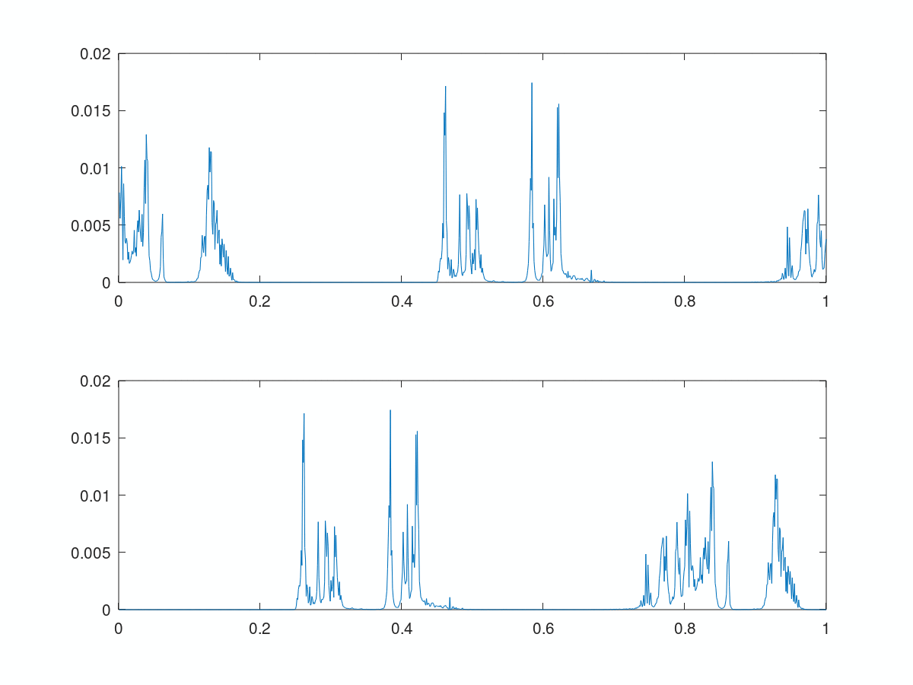
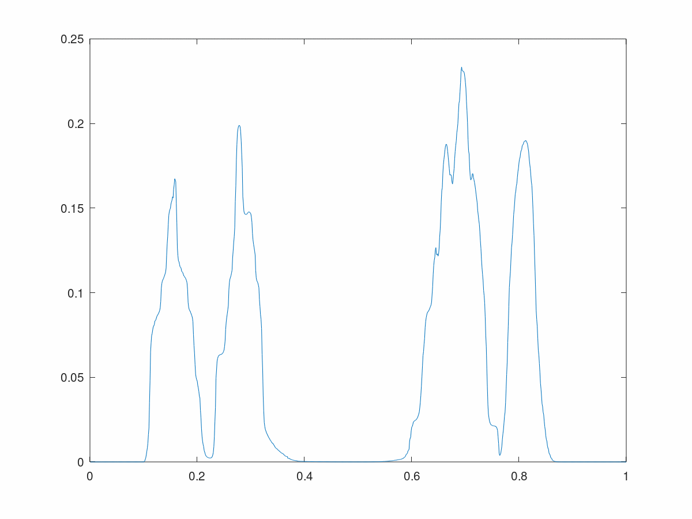

<!---
版本    日期    作者    描述
v1.0    2019.06.25  lous    文件创建
-->

为了完成在校时的愿望，最近开始拾起了魔方还原助手的。最终目标：上架各大应用市场，作为一款应用软件为广大魔方爱好者提供帮助。

如果你对此项目也感兴趣，请不要重复造轮子。我们会非常欢迎的你加入！

用户直接通过手机按一个简单的规则拍摄六个面的照片，然后软件开始通过图像识别算法建立魔方当前状态。算法完成后，通过图像或者动画示意具体的还原步骤（平均控制在30步以内）。

最终只需要不到1分钟，初学者也能还原一个被打乱的魔方。

## 颜色识别

### 数据采集

因为不打算用复杂的深度学习算法，所以对数据作了一定的限制。

假设魔方是一个常见的六色3阶魔方，即每个色块都为纯色。

表面U



前面F


下面D



右面R



后面B



左面L



当时拍摄的是用Nokia，能看到是有明显的色差的

有几个色块肉眼已经很难分辨出到底是什么颜色了，我们希望在这个场景下依旧能够识别处魔方各个面色块的分布情况。

### HSV

RGB空间并不适合于我们对颜色的主观判断

把图像转换至HSV空间

原始图像

Hue

Saturation

Value




### 阈值自适应

通过value分量可以估算处黑色的光强范围，是否可以考虑加入灰度平衡？

饱和度用于识别处白色的区块，这是因为HSV空间中黑色和白色的色调比较特殊。

剔除了黑色和白色区域后，统计剩下区域的色调分布，其分布应该是聚集在hue尺度上五个不同的区域，需要注意到hue会翻转。


saturation_weight = 0.95;
sv_thresh = 0.75;
black_value_thresh=0.2;

$Value < black\_value\_thresh$

$(1-saturation\_weight)*Value+ saturation\_weight *(1-Saturation) > sv\_thresh$



到这一步就把彩色部分提取出来了，下一步我们需要根据色调对颜色进行分类。

提取到彩色的部分，并对所有像素点做统计。



因为已经剔除了白色，所以理想情况下我们应该能看到五个明显簇。但从直方图上我们只能看到四个。因为hue可以反转（0和1可以代表同一个颜色-红色），所以我们很难在这幅图上直接统计出几个色块的平均Hue值。

因为我们可以直接给出两个颜色之间的相差程度，即在Hue圆周上的夹角，因为rgb转到HSV时已经归一化了，所以两个颜色$hue_a$和$hue_b$之间的距离

$$
D(a,b)=0.5-abs(abs(hue_a-hue_b)-0.5)
$$

是否可以考虑用聚类分析的方法把所有点先分类，然后再计算质心（单面纯色的估计值）。

测试了下K-means，效果不理想。

假设同一个面的hue偏差不超过0.05，我们可以滑动计算宽度为0.1的窗口内总的点数，窗口内总的点数占比应该是接近0.2的。

固定大小的窗口移动统计总点数后



可以看到在0.6-0.8之间是有混淆的

初步估计5个值应该是0.15 0.28 0.68 0.73 0.83

也就是说我们根本无法直接计算出0.7左右的两个hue值，但是可以通过概率估计

突然想到了在做声纹识别时的一种特征提取方法，混合高斯模型。

事实上我们可以认为色调的偏差分布是一个高斯分布，这样估算出的五个均值应该会非常接近理论值。

```
Clust 1: weight 0.420881
        Mean: 0.248413
        Variance: 0.0044690
Clust 2: weight 0.300516
        Mean: 0.747398
        Variance: 0.0042292
Clust 3: weight 0.119645
        Mean: 0.748971
        Variance: 0.0042653
Clust 4: weight 0.0805644
        Mean: 0.748187
        Variance: 0.0042491
Clust 5: weight 0.0783928
        Mean: 0.748112
        Variance: 0.0042475
```

实际依旧不理想……

## 参考

- [wikipedia HSL HSV](https://en.wikipedia.org/wiki/HSL_and_HSV)

- [MATLAB中“fitgmdist”的用法及其GMM聚类算法](https://www.cnblogs.com/kailugaji/p/10759419.html)

