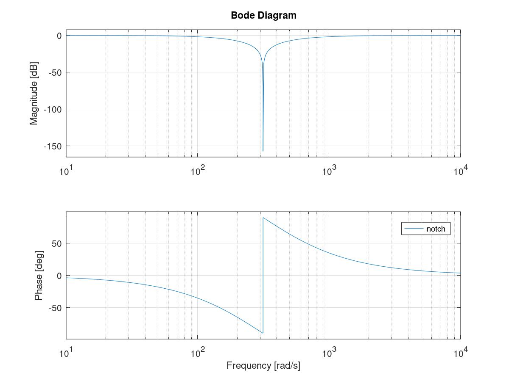

<!---
版本    日期    作者    描述
v1.0    2019.06.04  lous    文件创建

-->

数字滤波器

## 滤波器

FIR(Finite Impulse Response)滤波器：有限长单位冲激响应滤波器
IIR()

### 一阶滤波器

### 二阶滤波器

### 卡尔曼滤波器

[UNC 推导](https://www.cs.unc.edu/~welch/media/pdf/kalman_intro.pdf)


#### 过程

假设状态向量为$x \in \mathcal{R}^n$则$k$时刻的状态可由$k-1$时刻的状态表示如下：

$$
x_k=Ax_{k-1}+Bu_{k-1}+w_{k-1}
$$

$u \in \mathcal{R}^l $为系统输入，$w_k$为$k$时刻的过程噪声。

$A_{n \times n}$ 状态转移矩阵

$B_{n \times l}$ 控制输入矩阵

因为测量存在误差，假设$x$的观测值$z \in \mathcal{R}^m $：

$$
z_k=Hx_k+v_k
$$

$H_{m \times n}$ 状态观测矩阵

$v_k$为$k$时刻的测量噪声。

假设$v$和$w$都为白噪声。

$$
p(w) \sim N(0,Q)
$$

$$
p(v) \sim N(0,R)
$$

#### 计算

先验估计（预测）误差

$$
e_k^- \equiv x_k - \hat{x} _k^- 
$$

后验估计（测量）误差

$$
e_k \equiv x_k - \hat{x} _k 
$$

$\hat{x} _k^-$为$x_k$的先验值（观测值未获取时的预测值），$\hat{x} _k$为$x_k$的后验值（观测值$z_k$获取到后的估计值）。

$$
e_{k+1}^- = x_{k+1} - \hat{x}_{k+1}^- \\
= (A x_k + B u_k + w_k) - (A \hat{x}_k + B u_k) \\
= A(x_k - \hat{x}_k) + w_k
$$


估计误差的协方差$P_k^-=E[ e_k^- e_k^{-T}]$

后验估计误差的协方差$P_k=E[ e_k e_k^T]$

$$
\hat{x}_k=\hat{x}_k^- + K(z_k - \hat{z}_k)=\hat{x}_k^- + K(z_k - H \hat{x}_k^-)
$$

增益系数$K$代表着先验值的权重。

$$
K_k = P_k^- H^T (H P_k^- H^T + R)^{-1} \\
=\frac{P_k^-H^T}{H P_k^- H^T + R}
$$

当测量值权重增大时，$R \downarrow K_k \uparrow $

当预测值权重增大时，$R \uparrow K_k \downarrow $

#### 概率

$$
E[x_k] = \hat{x}_k
$$

$$
P_k = E[(x_k - \hat{x}_k)(x_k - \hat{x}_k)^T]
$$

$$
P_{k+1}^- = E[ e_{k+1}^- e_{k+1}^{-T}] \\
= E[(x_k - \hat{x}_k)(x_k - \hat{x}_k)^T] \\
=E[(Ae_k+w_k)(Ae_k+w_k)^T] \\
=E[(Ae_k)(Ae_k)^T] + E[w_kw_k^T]
=A E[e_ke_k^T] A^T + Q \\
=A P_k A^T + Q
$$

#### 卡尔曼滤波器的计算过程

```c

for(;;)
{
    time_update();
    measurement_update();
}

```

预测阶段

1. $ \hat{x}_k^- = A \hat{x}_{k-1} + B u_{k-1} $
2. $P_k^- = A P_{k-1} A^T + Q$

估计阶段

3. $ K_k = P_k^- H^T (H P_k^- H^T + R)^{-1} $
4. $ P_k = (I - K_kH)P_k^-$ 
5. $ \hat{x}_k = \hat{x}_k^- + K_k (z_k - H \hat{x}_k^-) $ 状态更新


### 陷波滤波器 (notch filter)

理想情况下陷波滤波器是个点阻滤波器，实际工程上是一个非常窄的带阻滤波器。

[NYU 解释](engineering.nyu.edu/mechatronics/Control_Lab/Padmini/Fiberoptics/Notch_Filter.doc)

滤波器传递函数

$$
G(s)=\frac{s^2+\omega_n^2}{s^2+2\omega_ns+\omega_n^2}
$$

其Bode图如下




## 相关资源

[如何快速设计一个FIR滤波器（一）](https://zhuanlan.zhihu.com/p/45138629)