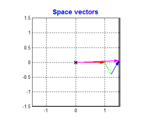
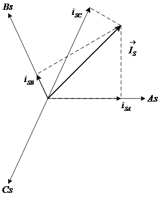
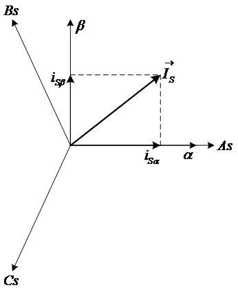
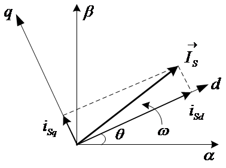
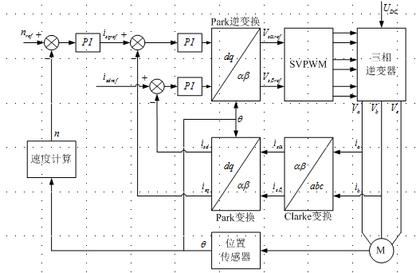
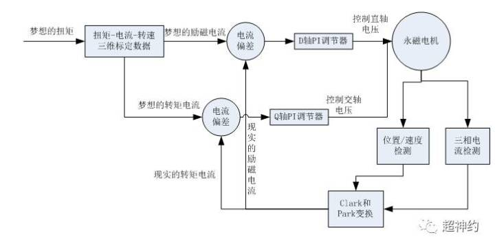
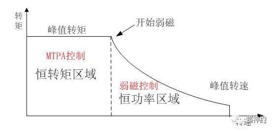

2018年11月

项目中使用到了直线电机，当时电气信号的软件控制基本已经完成测试。各传感器和执行器的功能检测无误，但当整个模块集成调试时发现一个控制系统的性能不达标，轴运动过程中控制误差太大。

后请教控制专业的同事，经多次排查发现电机出力不均匀。在不同位置上电机出力是不均匀的。此时才意识到电机存在换向问题。

>个人理解：
交流电机输出的三相电流产生的力的合力才是电机输出力。
不同位置上电机的相位关系是不同的，因此需要电机能够自动换相。
有刷电机直接靠自生的物理结构完成换相，而无刷电机则需要电机驱动器完成换相。

为了彻底理解电机的控制原理，查阅整理内容如下

## 闭环控制上电机的作用

一般电机有三环控制：

1. 位置环
2. 速度环
3. 电流环

因为产品有自制的运动控制器，所以把电机配置成了电流环。

故希望控制器下发的参数直接能转化为电机输出的扭矩，这样控制器的闭环输入为编码器的位置信号，输出就是电机的扭矩/力。

## 永磁电机控制原理

控制流程

1. 控制器输出扭矩的数字量信号
2. 电气经PWM调制放大成对应的模拟电压
3. 电压输入给电机转化成电流
4. 电流经过绕组产生扭矩

```mermaid
graph LR;

    控制器-->扭矩数字量;
    扭矩数字量-->模拟量电流
    模拟量电流-->电机;
    电机-->扭矩;
```

## 永磁电机的工作原理

在永磁电机正式开始工作之前需要对其进行标定，尽可能使控制器下发的数字量输出准确的转化为电机的实际物理扭矩输出。

需要标定：转速—转矩—电流的对应关系

标定完成之后，电机驱动器可以根据当前转速和设定的输出转矩可以得到末端执行器电机的输入电流

*电机必须含有能测量电流的装置，不然无法完成电流环PID自整定*

紫色的合成矢量可认为是电机的合成电流矢量。

$i_{SA} = I_m \cdot \sin(\omega t + \phi)$
$i_{SB} = I_m \cdot \sin(\omega t + 2 \pi /3 +\phi)$
$i_{SC} = I_m \cdot \sin(\omega t + 4 \pi /3 +\phi)$

3相/2相变换（Clarke变换）：根据变换前后功率不变的约束条件，以定子电流为例：

$$
\left[ \begin{array}{c} I_\alpha \\ I_\beta \end{array} \right] = \sqrt{ \frac{2}{3} } \left[ \begin{array}{cc} 1 & -\frac{1}{2} & -\frac{1}{2} \\ 0 & \frac{\sqrt{3}}{2} & -\frac{\sqrt{3}}{2} \end{array} \right]  \left[ \begin {array}{cc} I_a \\ I_b \\ I_c \end{array} \right]
$$

旋转变换(Park变换)：根据变换前后功率不变的约束条件，同样以定子电流为例：

$$
\left[ \begin {array}{cc} I_d \\ I_q \end{array} \right] = \left[ \begin {array}{cc} \cos \theta & \sin \theta \\ -\sin \theta & \cos \theta \end{array} \right] \left[ \begin {array}{cc} I_\alpha \\ I_\beta \end{array} \right] 
$$

以转子磁场方向作为坐标系$Y$轴可以把合成电流$Is$分解成

直轴（Direct-axis）：直轴电流（$Id$）

交轴（Quadrature axis）：交轴电流（$Iq$） 

$$
Is^2=Id^2+Iq^2
$$

- $Id$ - 产生反电动势，可对永磁体增磁或弱磁
- $Iq$ - 产生作用于转子的扭矩，使转子旋转

*Note: Clack变换和Park变换*

1. 驱动器根据下发的转速，计算得到$i_{sqref}$($Iq$分量的参考值)作为Park逆变器的输入
2. Park逆变器的PI控制器根据$i_{sqref}$和实际测量出的$I_d$和$I_q$做闭环控制，输出给Park逆变器
3. Park逆变器根据输入的$I_d$和$I_q$，输出三相电压的$V_{s \alpha ref}$和$V_{s \beta ref}$
4. SVPWM变换器根据$V_{s \alpha ref}$和$V_{s \beta ref}$使三相逆变器产生对应的$V_a$、$V_b$、$V_c$ 三相电压

>SPWM
在PWM的基础上改变了调制脉冲方式，脉冲宽度时间占空比按正弦规律排列，这样输出波形经过适当的滤波可以做到正弦波输出。

>对于异步电机来说：我们只需要在A，B，C三相提供120相位差的正弦电压，电机就会稳定的转动起来，由冲量等效原理作为理论支撑，SPWM控制逆变器输出等宽不等高的梯形波。此梯形波与正弦波的冲量等效。故在A，B，C三相输出冲量等效的梯形波，其作用效果与正弦波差不多。因为本文重点在于SVPWM，故在这里不再继续讲解SPWM.
SVPWM
为什么要弄出来个SPWM，它的优点在于哪里？SVPWM与传统的正弦PWM不同，它是从三相输出电压的整体效果出发，着眼于如何使电机获得理想圆形磁链轨迹。因为表面上看我们要的输出是三相正弦波，本质上讲是正弦波产生的旋转磁场在带着转子在转动啊。故 SVPWM技术与SPWM相比较，绕组电流波形的谐波成分小，使得电机转矩脉动降低，旋转磁场更逼近圆形，而且使直流母线电压的利用率有了很大提高，且更易于实现数字化。
SVPWM 的理论基础是平均值等效原理，即在一个开关周期内通过对基本电压矢量加以组合，使其平均值与给定电压矢量相等。在某个时刻，电压矢量旋转到某个区域中，可由组成这个区域的两个相邻的非零矢量和零矢量在时间上的不同组合来得到。两个矢量的作用时间在一个采样周期内分多次施加，从而控制各个电压矢量的作用时间，使电压空间矢量接近按圆轨迹旋转，通过逆变器的不同开关状态所产生的实际磁通去逼近理想磁通圆。

恒定转矩区域，转速与电流成正比。

$Iq=Is$

为了继续提高转速我们可以把$Id$反向，弱磁作用于转子。这样反电动势就会减小，电机转速继续增大，但转矩会下降。

实际工程中电机电流不可能无限大，并且随着转速的增加功耗成几何倍数增长。所以电机在空载时会有个最大转速。（之前有个项目无PID控制的电机的速度均匀性居然比有控制器的电机还好，主要就是无控制器的减速比太大，电机直接到达最大转速……）

## 电机驱动器的三环控制

### 位置环

根据测量到位置信号作为控制器输入，完成闭环控制

输出可以是速度或者

### 速度环

根据测量到速度信号作为控制器输入，完成闭环控制

输出为电流

### 电流环

根据测量到电流信号作为控制器输入，完成闭环控制

涉及到换相

通过霍尔传感器或者编码器测量转子的位置，并决定换相时间

### 参考

1. [怎样理解永磁同步电机控制中的“矢量控制”？](https://www.zhihu.com/question/20724715)
2. [永磁同步电机矢量控制之——“基础”](https://zhuanlan.zhihu.com/p/23267332?refer=zhishixuediande)
3. [SVPWM 三相逆变器电压空间矢量调制 初入门](https://blog.csdn.net/u013414501/article/details/82747573)
4. [无刷直流电机经典换相方式](https://wenku.baidu.com/view/c2c1db8a680203d8ce2f242c.html)