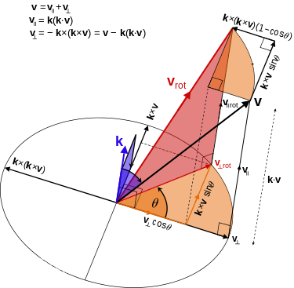

<!---
版本    日期    作者    描述
v1.0    2019.06.20  lous    文件创建

-->

在进行姿态估计过程中，我们需要进行坐标系转化。

图像识别定位过程，也会有相机坐标系和世界坐标系之间的转化。

## 三维直角坐标系转化

欧拉角 转换矩阵 旋转向量 四元数 

旋转向量和四元数计算相对简单些。

### 欧拉角

真是哪里都离不开这个男人……


$$
[\mathbf{R}] = \begin{bmatrix}
\cos \gamma & \sin \gamma & 0 \\
-\sin \gamma & \cos \gamma & 0 \\
0 & 0 & 1 \end{bmatrix} \begin{bmatrix}
1 & 0 & 0 \\
0 & \cos \beta & \sin \beta \\
0 & -\sin \beta & \cos \beta \end{bmatrix} \begin{bmatrix}
\cos \alpha & \sin \alpha & 0 \\
-\sin \alpha & \cos \alpha & 0 \\
0 & 0 & 1 \end{bmatrix}
$$

$$
[\mathbf{R}] = \begin{bmatrix}
\cos\alpha\cos\gamma-\cos\beta\sin\alpha\sin\gamma & \sin\alpha\cos\gamma+\cos\beta\cos\alpha\sin\gamma   & \sin\beta\sin\gamma
\\-\cos\alpha\sin\gamma-\cos\beta\sin\alpha\cos\gamma & -\sin\alpha\sin\gamma+\cos\beta\cos\alpha\cos\gamma & \sin\beta\cos\gamma 
\\ \sin\beta\sin\alpha & -\sin\beta\cos\alpha & \cos\beta 
\end{bmatrix}
$$

### 旋转矩阵表示

绕 $X$、$Y$ 或 $Z$ 单个轴旋转 $θ$ （右手螺旋）

$$
\begin{bmatrix}x' \\ y' \\ z'\end{bmatrix} = R * \begin{bmatrix}x \\ y \\ z\end{bmatrix}
$$

其中 $R$ 就是三阶的旋转矩阵。

仅绕坐标轴的旋转矩阵可表示为

$$
R_X=\begin{bmatrix} 1&0&0\\ 0&cos\theta&-sin\theta\\ 0&sin\theta&cos\theta \end{bmatrix}
$$

$$
R_Y=\begin{bmatrix} cos\theta&0&sin\theta\\ 0&1&0\\ -sin\theta&0&cos\theta \end{bmatrix}
$$

$$
R_Z=\begin{bmatrix} cos\theta&-sin\theta&0\\ sin\theta&cos\theta&0\\ 0&0&1 \end{bmatrix}
$$

任意一个旋转都可以由三个旋转组合得到。

$$
\mathcal{M}(\hat{\mathbf{v}},\theta) = \begin{bmatrix}
   \cos \theta + (1 - \cos \theta) x^2
 & (1 - \cos \theta) x y - (\sin \theta) z 
 & (1 - \cos \theta) x z + (\sin \theta) y  
\\
   (1 - \cos \theta) y x + (\sin \theta) z 
 & \cos \theta + (1 - \cos \theta) y^2
 & (1 - \cos \theta) y z - (\sin \theta) x
\\
   (1 - \cos \theta) z x - (\sin \theta) y
 & (1 - \cos \theta) z y + (\sin \theta) x
 & \cos \theta + (1 - \cos \theta) z^2 
\end{bmatrix}
$$

通过旋转矩阵不能直观地看出旋转的方向和角度，直接能到角度算我输。

生成元表达（没看懂……）

$$
\mathcal{M}(\hat{\mathbf{v}},\theta) 
 = \exp\left( \begin{bmatrix}
         0   &  -z\theta & y\theta \\
   z\theta &     0    &  -x\theta  \\
    -y\theta & x\theta &      0    \\
\end{bmatrix}\right)
$$

旋转变换本身只有3个自由度，但旋转矩阵有9个元素，因此旋转矩阵中的元素不是相互独立的，这在非线性优化中会带来问题。


### 旋转向量表示

[罗德里格旋转公式](https://baike.baidu.com/item/%E7%BD%97%E5%BE%B7%E9%87%8C%E6%A0%BC%E6%97%8B%E8%BD%AC%E5%85%AC%E5%BC%8F) *Rodrigues' rotation formula*

设$\mathbf{v}$是一个三维空间向量，$\mathbf{k}$是旋转轴的单位向量，则$\mathbf{v}$在右手螺旋定则意义下绕旋转轴k旋转角度$\theta$得到的向量可以由三个不共面的向量$\mathbf{v}$, $\mathbf{k}$和$\mathbf{k} \times \mathbf{v}$构成的标架表示。



$$
\mathbf{ v_{rot} }=\cos\theta\cdot \mathbf{v} +(1-\cos\theta)(\mathbf{v} \cdot \mathbf{k})\mathbf{k} +\sin\theta\cdot \mathbf{k} \times \mathbf{v}
$$


设旋转向量的单位向量为 $r$，模为 $\theta$。三维点（或者说三维向量）$p$ 在旋转向量 $r$ 的作用下变换至 $p'$，则：

$$
p'=\cos\theta\cdot p+(1-\cos\theta)(p\cdot r)r+\sin\theta\cdot r \times p
$$


### 旋转向量和旋转矩阵之间的转换关系

设旋转向量的单位向量 $r=[r_x\ r_y\ r_z]^T$，旋转角度为 $θ$，对应的旋转矩阵为 $R$，则 $r$ 到 $R$ 的转换是：

$$
R = \cos\theta I+(1- \cos\theta) r r^T+\sin\theta
\begin{bmatrix}
0&-r_z&r_y\\
r_z&0&-r_x\\
-r_y&r_x&0
\end{bmatrix}
$$

其中 $I$ 是三阶单位矩阵。反过来 $R$ 到 $r$ 的转换则可以利用等式：

$$
\frac{R-R^T}{2}=\sin\theta
\begin{bmatrix}
0&-r_z&r_y\\
r_z&0&-r_x\\
-r_y&r_x&0
\end{bmatrix}
$$

### 四元数表示

$$
q = q_0 + q_1 i + q_2 j + q_3 k
$$

其中

$$
 \begin{array}{l} {i^2} = {j^2} = {k^2} =  - 1\\ ij = k,ji =  - k\\ jk = i,kj =  - i\\ ki = j,ik =  - j \end{array}
$$

绕单位向量$\mathbf{n}=\left[ n_x, n_y, n_z \right]^T$进行了角度为θ的旋转，那么这个旋转的四元数形式为：

$$
q = \left[ \cos \frac{\theta}{2}, n_x \sin \frac{\theta}{2}, n_y \sin \frac{\theta}{2}, n_z \sin \frac{\theta}{2}\right]^T
$$

根据四元数$q$我们也可以知道其旋转角和旋转轴

$$
q = q_0 + q_1 i + q_2 j + q_3 k
$$

$$
\theta  = 2\arccos{ q_0 }
$$

$$
 [ n_x , n_y , n_z ]^T = [q_1,q_2,q_3]^T \sin \frac{\theta}{2} 
$$

把三维空间点$[x,y,z]$用一个虚四元数$\mathbf{p}$来描述：

$$
\mathbf{p} = [0, x, y, z]
$$

$$
\mathbf{n}=[ n_x, n_y, n_z ]^T
$$

$$
\mathbf{q} = [\cos \frac{\theta}{2}, \mathbf{n} \sin \frac{\theta}{2} ].
$$

四元数的共轭为：

$$
\mathbf{q}^* = s - xi - yj - zk = [s, -\mathbf{v}]
$$

四元数的模长定义为：

$$
\| \mathbf{q} \| = \sqrt{ s^2 + x^2 + y^2 + z^2 }
$$

四元数的逆为：

$$
\mathbf{q}^{-1} = \mathbf{q}^* / \| \mathbf{q} \| ^2
$$

四元数$\mathbf{q}_a$和$\mathbf{q}_b$的乘为：

$$
\begin{array}{lll} \mathbf{q}_a \mathbf{q}_b & = &  s_a s_b - x_ax_b - y_ay_b - z_az_b \\ && + ( s_ax_b + x_as_b + y_az_b - z_ay_b )i \\ &&+ ( s_ay_b - x_az_b + y_as_b + z_ab_b )j \\ &&+ ( s_az_b + x_ay_b - x_by_a + z_as_b )k  \end{array}
$$

旋转后的点$\mathbf{p}'$即可表示为这样的乘积

$$
\mathbf{p}' = \mathbf{q} \mathbf{p} \mathbf{q}^{-1}
$$

$\mathbf{p}'$的虚部即为转换后的坐标点$[x',y',z']$

Octave 下四元数计算点$[1, 1, 1]$绕$[-1, -1, 1]$


```matlab
function dst = quaternion_rotate(src,axis,theta)
% lous quaternion_rotate - rotate a 3-D point src
% around axis theta radian
%
% Syntax: dst = quaternion_rotate(src,axis,theta)
%

pkg load quaternion
theta=theta/2;
p_src=quaternion (0,src(1),src(2),src(3));
q=quaternion(cos(theta),sin(theta)*axis(1),sin(theta)*axis(2),sin(theta)*axis(3));
qinv = inv (q);
p_dst=(q.*p_src).*qinv;
dst=[p_dst.x,p_dst.y,p_dst.z];
    
end
```

## 参考

- [百度百科 旋转矩阵](https://baike.baidu.com/item/%E6%97%8B%E8%BD%AC%E7%9F%A9%E9%98%B5)
- [百度百科 罗德里格旋转公式](https://baike.baidu.com/item/%E7%BD%97%E5%BE%B7%E9%87%8C%E6%A0%BC%E6%97%8B%E8%BD%AC%E5%85%AC%E5%BC%8F)
- [视觉SLAM中的数学基础 第四篇 李群与李代数（2）](https://www.cnblogs.com/gaoxiang12/p/5577912.html)
- [三维坐标变换——旋转矩阵与旋转向量](https://blog.csdn.net/mightbxg/article/details/79363699)
- [世界坐标系和相机坐标系,图像坐标系的关系](https://blog.csdn.net/waeceo/article/details/50580607)
- [视觉SLAM中的数学基础 第二篇 四元数](https://www.cnblogs.com/gaoxiang12/p/5120175.html)

