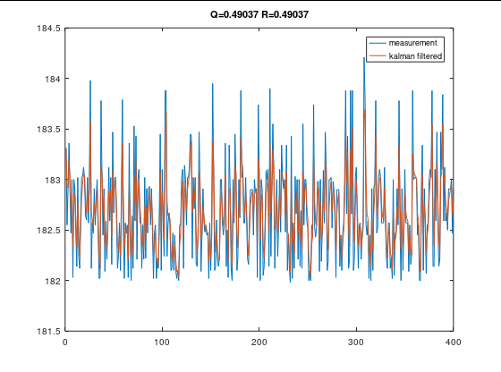

<!---
版本    日期    作者    描述
v1.0    2019.06.16  lous    文件创建
-->

多传感器信息融合中经常会使用到卡尔曼滤波器。

具体推导过程请参见[滤波器](../../controller/page/filter.md)

## 迭代过程

预测阶段

$$
\hat{x}_k^-=A\hat{x}_{k-1}+Bu_{k-1}
$$

$$
P_k^- = A P_{k-1} A^T + Q
$$

估计阶段

$$
K_k = P_k^- H^T (H P_k^- H^T + R)^{-1}
$$

$$
P_k = (I - K_kH)P_k^-
$$

$$
\hat{x}_k = \hat{x}_k^- + K_k (z_k - H \hat{x}_k^-)
$$

## 测试数据

数据从Arduino 超声波模块获取到一组测量[数据](../src/octave_kalman_filter/sonar.txt)

测试时传感器和被测物体并未发生相对位移，故理想距离应该不变。

## 测试脚本

```matlab
clear ;close all; clc;

load 'sonar.txt'

R=std(sonar);%测量噪声
Q=std(sonar);%过程噪声
A=1;
B=1;
H=1;

z=sonar(1:400);%观测值
u=zeros(size(z));%输入值
K=zeros(size(z));%卡尔曼增益
t=1:length(z);

Q=0.01*std(sonar);%过程噪声
[x,K]=kalman_filter(z,u,A,B,R,Q,H);


figure(1)
filename = 'kalman_filter_R_change.gif'; 

for i=1:10
Q=std(sonar);%过程噪声
R=std(sonar)*i;
[x,K]=kalman_filter(z,u,A,B,R,Q,H);
plot(t,z,t,x);
legend('measurement','kalman filtered')
title(['Q=' ,num2str(Q),' R=',num2str(R)])
drawnow
frame = getframe(1);
im = frame2im(frame);
[imind,cm] = rgb2ind(im);

if i == 1;
imwrite(imind,cm,filename,'gif', 'Loopcount',inf,'DelayTime',1);
else
imwrite(imind,cm,filename,'gif','WriteMode','append','DelayTime',1);
end

end

close all;

figure(1)
filename = 'kalman_filter_Q_change.gif'; 

for i=1:10
R=std(sonar);%测量噪声
Q=std(sonar)/i;
[x,K]=kalman_filter(z,u,A,B,R,Q,H);
plot(t,z,t,x);
legend('measurement','kalman filtered')
title(['Q=' ,num2str(Q),' R=',num2str(R)])
drawnow
frame = getframe(1);
im = frame2im(frame);
[imind,cm] = rgb2ind(im);

if i == 1;
imwrite(imind,cm,filename,'gif', 'Loopcount',inf,'DelayTime',1);
else
imwrite(imind,cm,filename,'gif','WriteMode','append','DelayTime',1);
end

end

close all;
```

## Q R 值对滤波效果的影响

R不变时，Q变小




Q不变时，R变大


