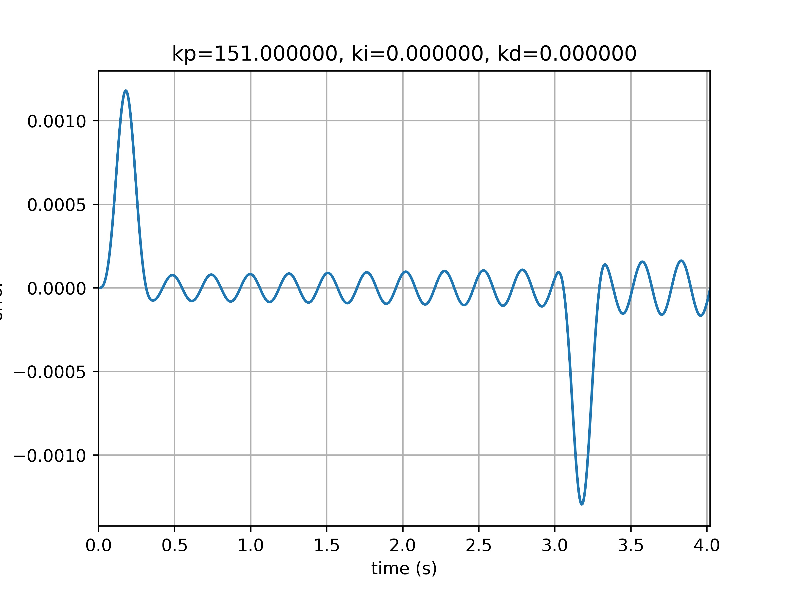
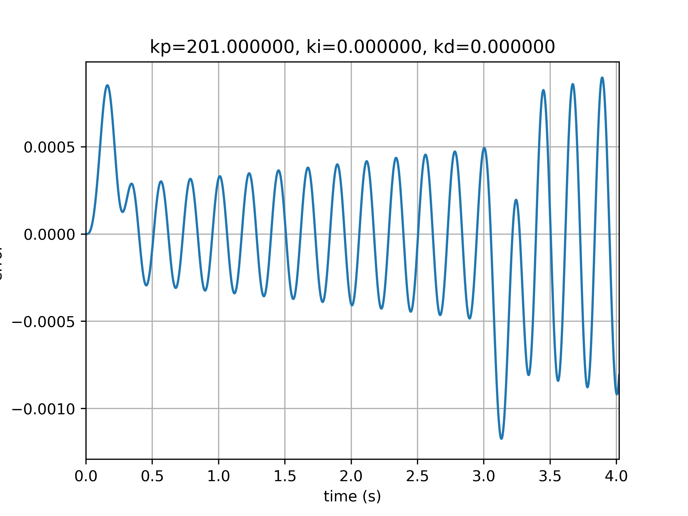
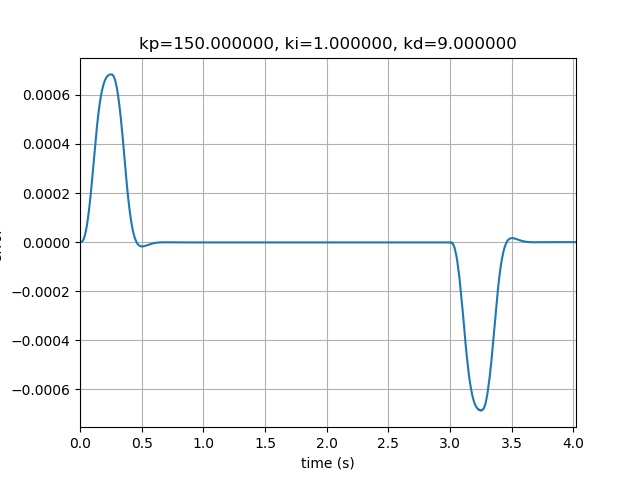
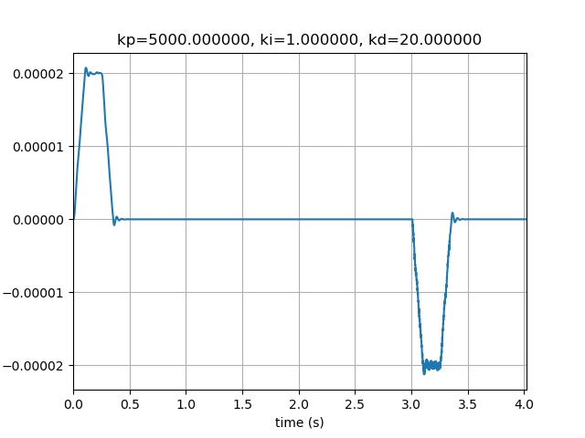

我们已经有了[设置点生成器](单轴轨迹三阶轨迹规划.md)，可以做前期的轨迹规划

为了完成简单的PID控制器仿真，我们还需要控制器模型和执行器系统（单轴）

## PID控制器

直接使用了开源项目[IvPID](https://github.com/ivmech/ivPID)，并作了适当的修改。

主要是这个控制器的仿真时间是获取本地时间，而我们需要设置仿真的采样时间。


## 抽象轴

除了PID控制器我们还需要完成一个抽象轴模型，可设置力和质量，并保存速度位置等状态信息。

```python
#!/usr/bin/python
# -*- coding:utf-8 -*-
# 2018-11-13 23：27 lous
# 仿真轴，可在此处实现模拟的传递函数
# =====================================

class AXIS:
    
    def __init__(self,pos,mass,sample_period):
        #速度 m/s
        self.velocity=0.0
        #位置 m
        self.act_pos=pos
        #加速度 m/s^2
        self.acceleration=0.0
        #质量kg
        self.mass=mass
        #力 N
        self.force=0.0
        #时间 s
        self.sample_period=sample_period

    #给指定大小的力
    def set_force(self,value):
        self.force=value
        self.acceleration=self.force/self.mass
    
    def get_pos(self):
        delta_time = self.sample_period
        delta_displacement = self.velocity*delta_time+0.5*self.acceleration*delta_time**2
        self.velocity+=self.acceleration*delta_time
        self.act_pos+=delta_displacement
        return self.act_pos
```

## 控制器

可设置Kp ki kd 参数和采样时间

```python
#!/usr/bin/python
# -*- coding:utf-8 -*-
# This file is part of IvPID.
# Copyright (C) 2015 Ivmech Mechatronics Ltd. <bilgi@ivmech.com>
#
# IvPID is free software: you can redistribute it and/or modify
# it under the terms of the GNU General Public License as published by
# the Free Software Foundation, either version 3 of the License, or
# (at your option) any later version.
#
# IvPID is distributed in the hope that it will be useful,
# but WITHOUT ANY WARRANTY; without even the implied warranty of
# MERCHANTABILITY or FITNESS FOR A PARTICULAR PURPOSE.  See the
# GNU General Public License for more details.
#
# You should have received a copy of the GNU General Public License
# along with this program.  If not, see <http://www.gnu.org/licenses/>.

# title           :PID.py
# description     :python pid controller
# author          :Caner Durmusoglu
# date            :20151218
# version         :0.1
# notes           :
# python_version  :2.7
# ==============================================================================

"""Ivmech PID Controller is simple implementation of a Proportional-Integral-Derivative (PID) Controller in the Python Programming Language.
More information about PID Controller: http://en.wikipedia.org/wiki/PID_controller
"""

class PID:
    """PID Controller
    """

    def __init__(self, P=0.2, I=0.0, D=0.0,sample_time=0):
        self.Kp = P
        self.Ki = I
        self.Kd = D
        self.sample_time = sample_time
        self.delta_time = self.sample_time
        self.clear()

    def clear(self):
        """Clears PID computations and coefficients"""
        self.SetPoint = 0.0
        self.PTerm = 0.0
        self.ITerm = 0.0
        self.DTerm = 0.0
        self.last_error = 0.0
        # Windup Guard
        self.int_error = 0.0
        self.windup_guard = 20.0
        self.output = 0.0

    def update(self, feedback_value):
        """Calculates PID value for given reference feedback
        math::
        u(t) = K_p e(t) + K_i \int_{0}^{t} e(t)dt + K_d {de}/{dt}
         figure:: images/pid_1.png
        :align:   center
        Test PID with Kp=1.2, Ki=1, Kd=0.001 (test_pid.py)
        """
        error = self.SetPoint - feedback_value
        delta_error = error - self.last_error
        self.PTerm = self.Kp * error

        self.ITerm += error * self.delta_time
        # 积分项限幅
        if (self.ITerm < -self.windup_guard):
            self.ITerm = -self.windup_guard
        elif (self.ITerm > self.windup_guard):
            self.ITerm = self.windup_guard

        self.DTerm = delta_error / self.delta_time

        # Remember last time and last error for next calculation
        self.last_error = error
        # 控制器输出
        self.output = self.PTerm + (self.Ki * self.ITerm) + (self.Kd * self.DTerm)

    def setKp(self, proportional_gain):
        """Determines how aggressively the PID reacts to the current error with setting Proportional Gain"""
        self.Kp = proportional_gain

    def setKi(self, integral_gain):
        """Determines how aggressively the PID reacts to the current error with setting Integral Gain"""
        self.Ki = integral_gain

    def setKd(self, derivative_gain):
        """Determines how aggressively the PID reacts to the current error with setting Derivative Gain"""
        self.Kd = derivative_gain

    def setWindup(self, windup):
        """Integral windup, also known as integrator windup or reset windup,
        refers to the situation in a PID feedback controller where
        a large change in setpoint occurs (say a positive change)
        and the integral terms accumulates a significant error
        during the rise (windup), thus overshooting and continuing
        to increase as this accumulated error is unwound
        (offset by errors in the other direction).
        The specific problem is the excess overshooting.
        """
        self.windup_guard = windup

    def setSampleTime(self, sample_time):
        """PID that should be updated at a regular interval.
        Based on a pre-determined sampe time, the PID decides if it should compute or return immediately.
        """
        self.sample_time = sample_time
        self.delta_time = self.sample_time


```

## 测试函数

给轴出力加5%的白噪声

```python
#!/usr/bin/python
# -*- coding:utf-8 -*-

import random
import PID
import matplotlib.pyplot as plt
from matplotlib import animation
import numpy as np
from scipy.interpolate import spline
import AXIS

# 读取setpoint数据
def read_setpoint(filename):
    f=open(filename)
    setpoint_list=f.readlines()
    data=[]
    for str in setpoint_list:
        data.append(float(str))
    return data

act_pos_list = []
time_list = []
setpoint_list = read_setpoint("setpoint_data.txt")
error_list=[]

def clear_history_data():
    del act_pos_list[:]
    del time_list[:]
    del error_list[:]
    
sample_period=0.001

result_str="  act_pos\tsetpoint\t    time\t    voice\t  output\t   error"
#假设PID输出为力
#PID的输入为位置
def test_pid(P = 0.2,  I = 0.0, D= 0.0):
    pid = PID.PID(P, I, D, sample_period)
    axis = AXIS.AXIS(0,1,sample_period)
    act_pos = 0
    error=0
    global result_str
    global setpoint_list
    i=0
    for value in setpoint_list:
        #实际位置为轴的位置
        act_pos=axis.get_pos()
        pid.update(act_pos)
        output = pid.output
        #给轴加力
        error=pid.last_error
        error_list.append(error)
        #给力加随机误差
        voice=gen_voice(0.05*abs(output))
        axis.set_force(output + voice)
        pid.SetPoint = value
        act_pos=axis.get_pos()
        act_pos_list.append(act_pos)
        i+=1
        time_list.append(i*sample_period)
        #保存数据
        result_str="%s\n%8.4f\t%8.4f\t%f\t%8.5f\t%f\t%f"%(result_str,act_pos,pid.SetPoint,i*sample_period,voice,output,error)

    
def save_result():
    f=open("result.log",'w')
    global result_str
    f.write(result_str)
    f.close()
    

def plot_error(fig_name,title):
    plt.ion()
    ax=plt.subplot()
    ax.plot(time_list, error_list)
    ax.set_xlim((0, time_list[-1]))
    ax.set_ylim((min(error_list)*1.1, max(error_list)*1.1))
    ax.set_xlabel('time (s)')
    ax.set_ylabel('error ')
    ax.set_title(title)
    im=ax.grid(True)
    ims.append(im)
    fig.savefig(fig_name,dpi=500)
    plt.show()
    plt.pause(0.5)
    fig.clf()
    #plt.close(fig)

    
def gen_voice(mag):
    return random.random()*mag-mag/2.0

def update_fig():
    clear_history_data()
    test_pid(kp, ki, kd)
    pass

if __name__ == "__main__":
    kp=60.0
    ki=0
    kd=0
    fig=plt.figure()
    ims=[]
    for kp in range(1,400,50):
        #for ki in range(1,15,5):
        # for kd in range(90,95,1):
        clear_history_data()
        test_pid(kp, ki, kd)
        print("kp = %f , ki = %f , kd = %f , max_error = %f"%(kp,ki,kd,max(error_list)))
        #save_result()
        # plot_result(500)
        fig_name="result_pics/"+"error_kp_%f_ki_%f_kd_%f.jpg"%(kp,ki,kd)
        title='kp=%f, ki=%f, kd=%f'%(kp,ki,kd)
        plot_error(fig_name,title)
        
    #anim = animation.FuncAnimation(fig, ims)
    #anim.save("auto_pid.gif",writer='pillow')


```

## PID参数调节

```
kp = 1.000000 , ki = 0.000000 , kd = 0.000000 , max_error = 0.049461
kp = 51.000000 , ki = 0.000000 , kd = 0.000000 , max_error = 0.004249
kp = 101.000000 , ki = 0.000000 , kd = 0.000000 , max_error = 0.002372
kp = 151.000000 , ki = 0.000000 , kd = 0.000000 , max_error = 0.001180
kp = 201.000000 , ki = 0.000000 , kd = 0.000000 , max_error = 0.000897
kp = 251.000000 , ki = 0.000000 , kd = 0.000000 , max_error = 0.000730
kp = 301.000000 , ki = 0.000000 , kd = 0.000000 , max_error = 0.001497
kp = 351.000000 , ki = 0.000000 , kd = 0.000000 , max_error = 0.000841
```




Kp继续增大时控制误差已经开始发散了



增加Ki作用不大后，适当修改Kd发现其稳态误差明显降低



继续增加Kp


```
kp = 200.000000 , ki = 1.000000 , kd = 1.000000 , max_error = 0.000787
kp = 200.000000 , ki = 1.000000 , kd = 10.000000 , max_error = 0.000514
kp = 400.000000 , ki = 1.000000 , kd = 10.000000 , max_error = 0.000271
kp = 600.000000 , ki = 1.000000 , kd = 10.000000 , max_error = 0.000181
kp = 700.000000 , ki = 1.000000 , kd = 10.000000 , max_error = 0.000155
kp = 1000.000000 , ki = 1.000000 , kd = 10.000000 , max_error = 0.000107
kp = 10000.000000 , ki = 1.000000 , kd = 10.000000 , max_error = 0.000011
kp = 10000.000000 , ki = 1.000000 , kd = 20.000000 , max_error = 0.000011
kp = 5000.000000 , ki = 1.000000 , kd = 20.000000 , max_error = 0.000021
```
控制误差已经小于20um了