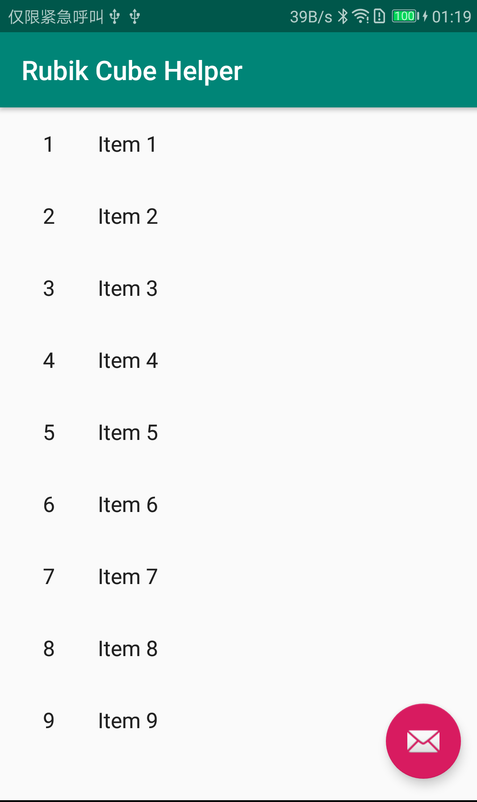
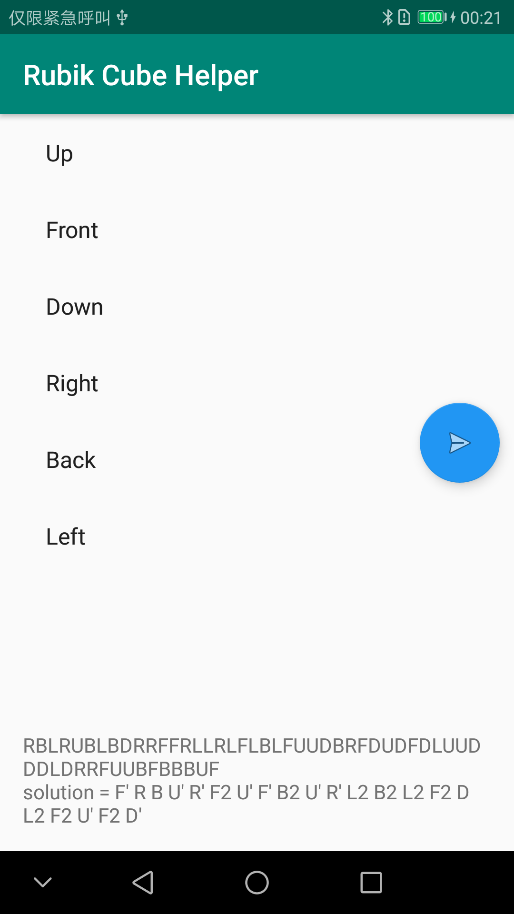

初步在安卓上实现魔方还原助手。之前考虑用Qt框架实现跨平台，但相应的移动端开发资料实在是太少，暂时不考虑。后续考虑跨平台实现的可能性。

因为之前没有接触过安卓开发，没法具体到每步该如何开展，但是可以把开发阶段分为以下几大步

1. 利用手机拍摄魔方6个面
2. 根据拍摄的图像识别当前魔方状态
3. 根据魔方当前状态计算还原步骤
4. 动画示意魔方还原步骤

## Android Studio 开发

[安装教程参考](http://www.runoob.com/w3cnote/android-tutorial-android-studio.html)

[Android Studio 官网下载](https://developer.android.google.cn/studio)

安装好后启动


新建一个新的项目

`Rubik Cube Helper`

真心好难用……各种被封

SDK使用代理

`mirrors.neusoft.edu.cn:80`

gradle 不太清楚作用是什么

而且`gradle.properties`文件代理出bug导致一直提示无法下载，删除重复项后可以下载了


C:\Users\name\.gradle\gradle.properties

居然也会有重复项……

项目的`build.gradle`里加上代理

```
allprojects {
    repositories {
        google()
        jcenter()
        maven { url 'http://maven.aliyun.com/nexus/content/groups/public/' }
    }
}
```

到选择一个模板稍作修改，编译部署



编译环境已经搭建好了，我们现在需要考虑如何实现拍照并存图。

## 拍照

先使用系统自带的API，熟悉安卓应用的基本开发之后再考虑做一个带有标记的拍照界面，类似微信扫一扫。

可能需要先学习Java……

主活动


子页面拍照


保存至本地


到这一步可以用octave离线计算

因为相机拍摄的有空隙，所以手动截取了

后续需要补充手机应用自动截取保存

```
Up.png
   2   5   1
   2   6   2
   4   5   5
Front.png
   2   6   1
   6   1   6
   3   5   6
Down.png
   2   2   3
   1   2   4
   3   1   2
Right.png
   6   3   4
   3   4   1
   5   3   5
Back.png
   6   3   5
   2   3   1
   1   5   4
Left.png
   3   4   1
   6   5   4
   6   4   4
```
人肉对比了下，应该是正确的

## Kociemba 还原算法

随机生成魔方状态并还原



结果显示在底部

## 图像识别实现

Android 好像自带矩阵运算，可以考虑用直接用矩阵运算解决。

[Android开发常用开源框架：图片处理](https://blog.csdn.net/axi295309066/article/details/56984137)

经过半天的折腾最终Android Studio 下opencv配置好了。

转灰度图了


## 参考

- [Android Studio开发入门-引用jar及so文件](https://www.cnblogs.com/xrwang/p/AndroidStudioImportJarAndSoLibrary.html)
- [Android Studio-—使用OpenCV的配置方法和demo以及开发过程中遇到的问题解决](https://www.cnblogs.com/yunfang/p/6149831.html)
- [使用Android Studio创建OpenCV 4.1.0 项目](https://blog.csdn.net/userhu2012/article/details/89522851)

